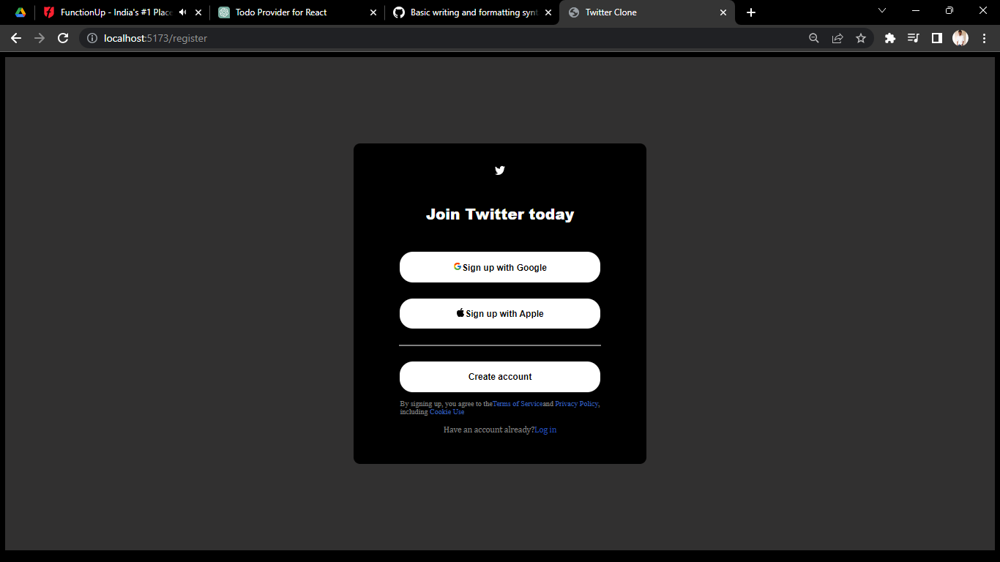
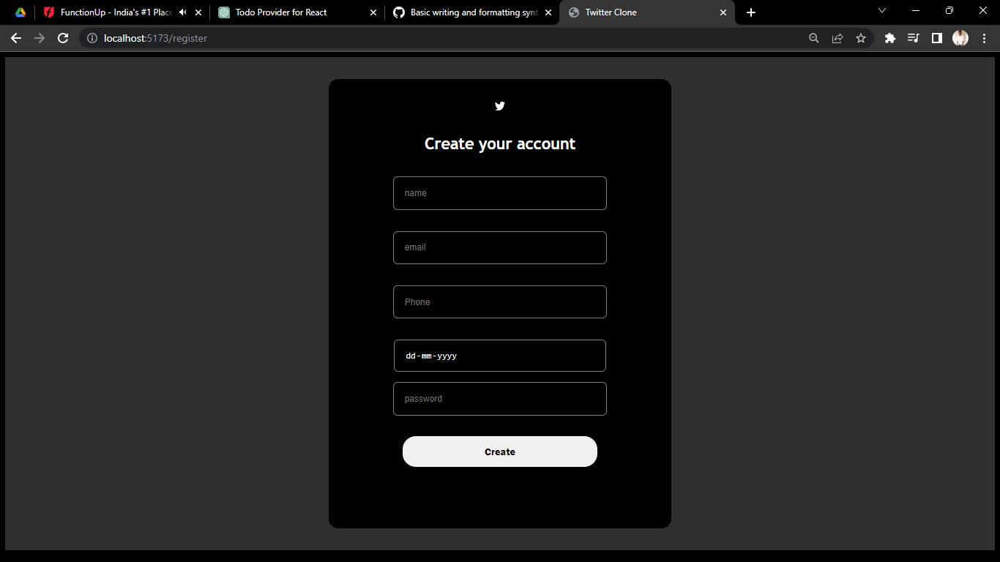
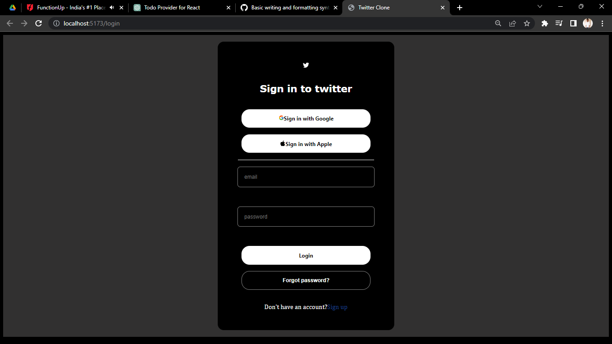
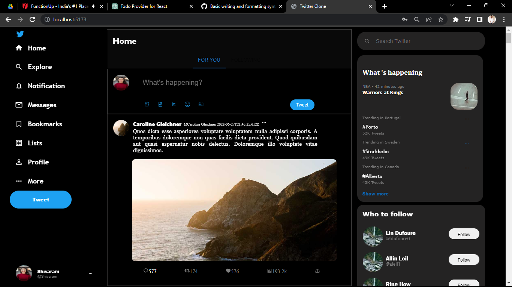

# Twitter Clone

This is a twitter clone, where user can able to create account, login with valid credentials and also able to add tweets by user.

## Create Account page

## Register page

## Login page

## Home page

## Deployment:
This project is deployed on open platform [vercel.com](https://vercel.com/) 

## Libraries

The following libraries are used in this project:

1. State Management: Recoil
2. UI Library: Material UI

## Collborators

1. Shivaram Dusa
2. SurajKumar Chaudhari
3. Subhadip Paul
4. Shubham Shinde

## Project Link

You can access this project at https://project1-gym-s63y.vercel.app/